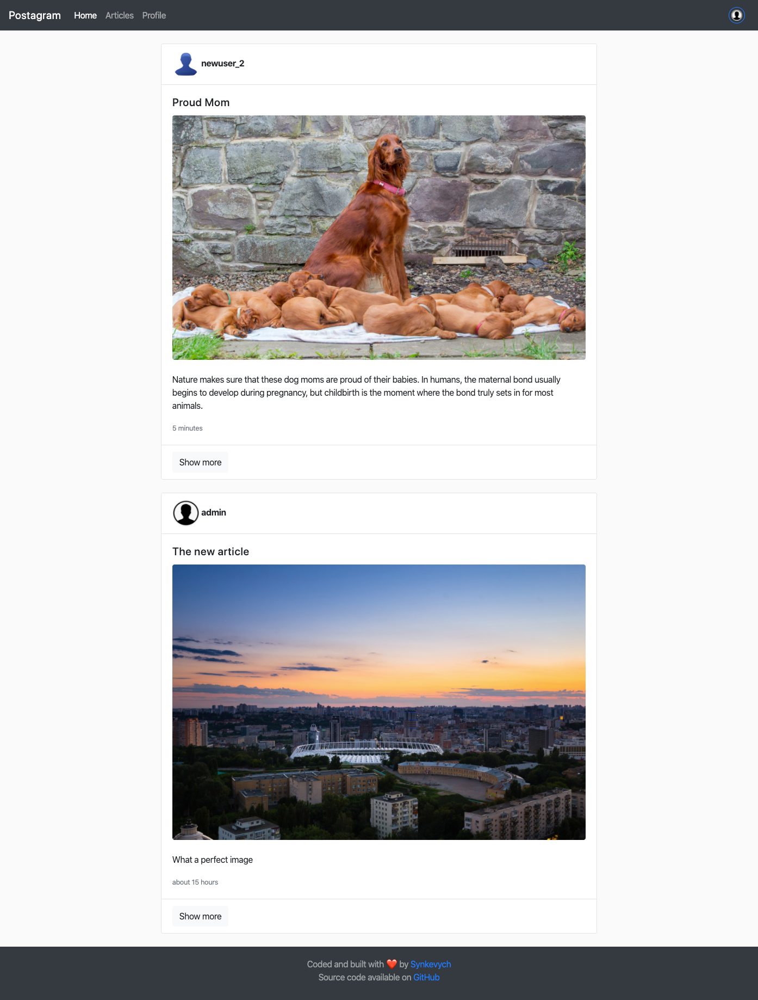

# README

## Yay! This project deployed on [Heroku](https://still-island-36889.herokuapp.com)

Ruby version: 2.6.5/2.6.3  
If you wanna do something, first set you task to list!  
After the merge it's save to delete the branch: `$ git branch -d branch1`
To prettify Ruby text inside Sublime: 
highlight all code and type Ctrl + Shift + H  / Alt + Shift + F in VSCode  
[How to use rake db](https://dev.to/neshaz/how-to-use-rake-db-commands-in-the-correct-way--50o2)  

### Tasks

1. Remove image if article deleted  
1. Show error message for user & comment form
1. Change logic of cheking user image
1. Pagination for more than 10 post
1. After click user name show user page with all his posts
1. More info about user

---

### First Install

If you're clonning this repo to install all Rails gems localy type:  

> bundle install

### Other tools to work with project

> <https://github.com/tulios/json-viewer>  
> <https://developers.themoviedb.org/3/movies>  
> <https://github.com/DavidAnson/vscode-markdownlint>  
> [cloudinary](https://cloudinary.com/) to save photo for free
> Active Record  

---

This README would normally document whatever steps are necessary to get the
application up and running.

Things you may want to cover:

* Ruby version

* System dependencies

* Configuration
`rails generate controller Comments`  
`rails g controller user new create`  

* Database creation
`rails generate model Article title:string text:tile`  

* Database initialization
`rails db:migrate` - создание таблиц в базе данных  
`rails db:migrate RAILS_ENV=development`  

`rake db:setup`  
Додавання нових полів в існуючу таблицю:  
`rails generate migration add_role_user role:string`

Для додавання foreing_key в таблицю articles через миграцию треба використовувати міграцію: `add_reference :articles, :user, foreign_key: true`

Після цього можна виконати автоматичне заповнення таблиці вик. файл seeds.rb  
`rails db:seeds` - запускає на виконання файл db/seeds.rb, дозволяє додавати в базу даних нові полями з файлу  

`rake db:reset db:migrate` видалення даних та створення таблиць заново

* How to run the test suite
`rails d controller welcome` - удалит контролер
`rails generate model Post title:string content:text`  
`rails destroy model Post title:string content:text`

* Services (job queues, cache servers, search engines, etc.)

* Deployment instructions
`heroku apps: destroy app1` - destroy your app at the heroku  
`heroku git:remote -a app2` - change the app from app1 to app2  

`heroku run rake db:migrate`

### Starting up the Web Server

> rails server    -> linux  
> ruby bin\rails server -> windows  
> rails s     -> short  
> rails generate controller Welcome index  
> the controller located *app/controllers/welcome_controller.rb*  
> the view *app/view/welcome/index.html.erb*  
> `<%= debug(params) if Rails.env.development? %>` to display dubug inforamtion

---

**Troubleshooting:**

> ! sqlite3 could not find  
> ! webpacker could not find  
> ! webpacker configuration file nor found (RuntimeError)  
> rails webpacker  
> install yarn  
> npm install yarn -g  
> rails new my_pg_app -d postgresql --- to create new project with PostgreSQL database
> bundler install > after updating some gems  
> git restore -s  postgres -- .\README.md  
> to show your db on pdAdmin connect to them with username and passwor which you created earlier

### Install Bundler on Mac

> sudo gem install bundler  
> brew install gcc

### Update Ruby on Mac

> rvm install ruby@2.6.5  
> rvm install ruby-2.6.5  
> rvm use 2.6.5 --default  

**Install Heroku:**
> install heroku from web site for windows  
> heroku login  
> heroku create  
> git push heroku master  
> rename **gem 'sqlite3'** to **gem 'pg'**  
> run: bundler install  
> rails db:create
> bundle exec rails webpacker:install  
> heroku pg:reset DATABASE --confirm YOUR_APP_NAME
> heroku run rake db:setup
> heroku run rake db:migrate
> `heroku restart` after running `pg:reset`  
> heroku open
> heroku run rails console
> heroku apps:errors
> [heroku logs](https://devcenter.heroku.com/articles/heroku-cli-commands)

---

### Create useful git messages

The type is contained within the title and can be one of these types:

> feat: a new feature  
> fix: a bug fix  
> docs: changes to documentation  
> style: formatting, missing semi colons, etc; no code change  
> refactor: refactoring production code  
> test: adding tests, refactoring test; no production code change  
> chore: updating build tasks, package manager configs, etc; no production code change

### What does it look like



### Work with Comment

The model Comment generator generate 4 files:

Create model for command: `rails generate model Comment commenter:string body:text article:references`

| __File__ | __Purpose__ |
| --- | --- |
| db/migrate/_create_comments.rb | to create the comment table |
| app/models/comment.rb | The comment model |
| test/models/comment_test.rb | Testing harness for the comment model |
| test/fixtures/comments.yml | Sample comments for use in testing |

Run migration: `rails db:migrate`. They create all new tables and columns.  

### Work with Rails Database / Model

`rake db:migrate` - checks which missing migrations still need to be applied to the database without caring about the previouse ones.  
`id, created_at, updated_at` was created by default for each ActiveRecord model.  

To generate a *model* you can use following field types:

* **binary** binary large object
* **boolean** true or false
* **date** to store a date
* **datetime** to store a date including a time
* **float** for storing a floating point number
* **integer** for storing an integer
* **decimal** for storing a decimal number
* **string** a sequence of any characters (255) characters
* **text** as a string but considerably bigger (65536) characters

Routing and Controllers

* **form_with** отправляет формы с использованием Ajax, тем самым не осуществляя редирект всей страницы.

* :article - определяющий объект для формы
* :url опция которая используется если нужно вести по специальному url
* plain: ключ который принимает метод render 
* params - метод, это объект, представляющий параметры (или поля), приходящие от формы. принимающий

### How to use Cloudinary

* Create account
* Add gem `gem 'cloudinary'` to Gemfile
* Copy `cloudinary.yml` with sitting from cloudinary site to the  _config_ folder
* Create migration, you need add to User model string column avatar

```ruby
  def change
        add_column :users, :avatar, :string
  end
```

* Run migration `rake db:migrate`
* Add to User model new string

```ruby
  attribute :avatar, default: 'https://res.cloudinary.com/demo/image/upload/d_avatar.png/non_existing_id.png'
```

* Change your User controller

```ruby
 def create_new_img(new_img)
    new_img_url = Cloudinary::Uploader.upload( new_img )
 end

def create  
  @user = User.create!( user_param)

  if !params[:user][:avatar].nil?
    new_img_url =  create_new_img(params[:user][:avatar])
    @user.update(:avatar => new_img_url['url'] )
  end

  @user.save
end
```

* Add to form image

```ruby
<li>
  <%= form.label :avatar %>
  <%= form.file_field :avatar %>
</li>
```

* Render your image at the form

```ruby
<% if !@article.image.nil? then %>
  <div class="card-img mb-2">
    <%= image_tag @article.image, class: 'rounded img-fluid' %>
  </div>
<% end %>
```

### Ruby Default Web Server

> bundle exec rackup
> 
